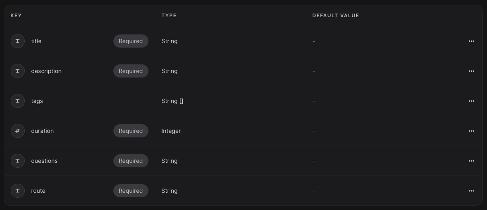
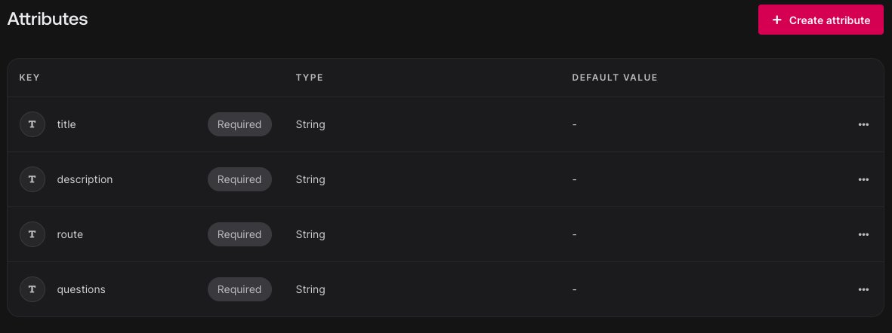

# MERN-MARN-Stack

Using [appwrite](https://appwrite.io/docs/quick-starts/react) for backend to store the quiz and interviews data
## How to Run?

Need to run `npm install` once to install all the packages.

To serve the application use - `npm run dev`

Open [http://localhost:5173/](http://localhost:5173/) in your browser.

## Database

### Collection - quizzes

Attributes -

### Collection - interviews

Attributes

## Todo
- [ ] User Auth and Profile
- [ ] Limited Duration
- [ ] Result Summary